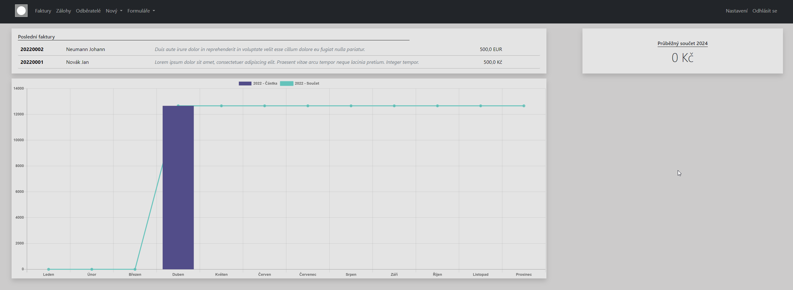
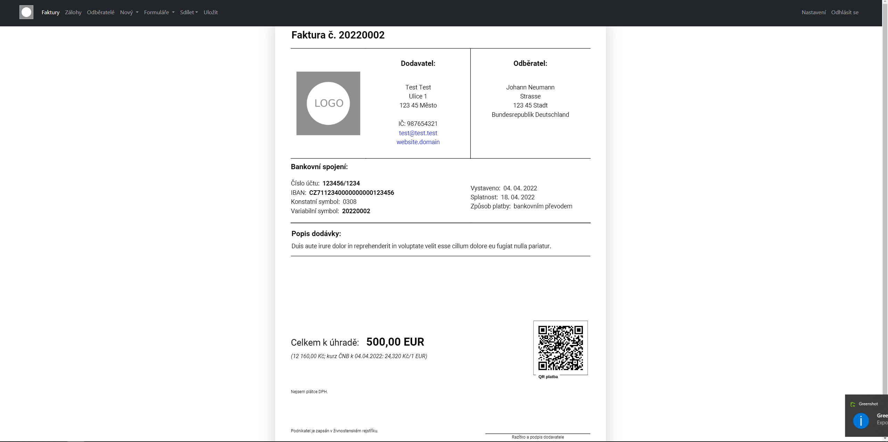

+++
title = 'Invoice management for small entrepreneurs'
date = 2022-04-04T12:35:58+02:00
draft = false
+++

Simple app for creating and managing invoices, customers build with Python/Django and SQL database. 
Twilio Sendgrid is used for sending invoice over email.

# Dashboard
Overview of last invoices and cashflow. Graph is made using Chart.js.

# Invoice preview
HTML preview of the given invoice. Every invoice intended for bank transfer payment includes QR code for comfort of use.
The app also supports payments in other currencies than CZK, exchange rates are pulled from Czech National Bank.

# Generated PDF
A pdf invoice can also be generated. The PDf is generated on backend, it is client independent.

## Demo 
http://beranekp.pythonanywhere.com/

Login: test@test.test
Password: 123456

source: https://github.com/BeranekP/InvoicesDjango
