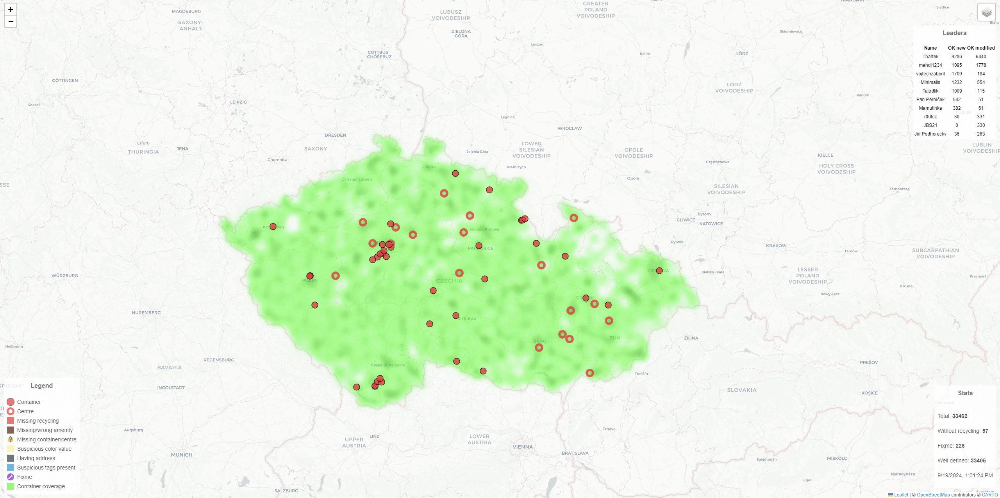

+++
title = 'Quality check of recycling container data in OpenStreetMap'
date = 2024-02-26T13:14:38+02:00
draft = false
+++

Simple app written in Golang to visualize tagging mistakes on recycling containers in the Czech Republic.
It pulls data from Overpass API, then filters them and presents them using Leaflet.js. Data is converted to GeoJSON, compressed and sent to client.

http://thartek.alwaysdata.net/

source: https://github.com/BeranekP/osm-recycle
