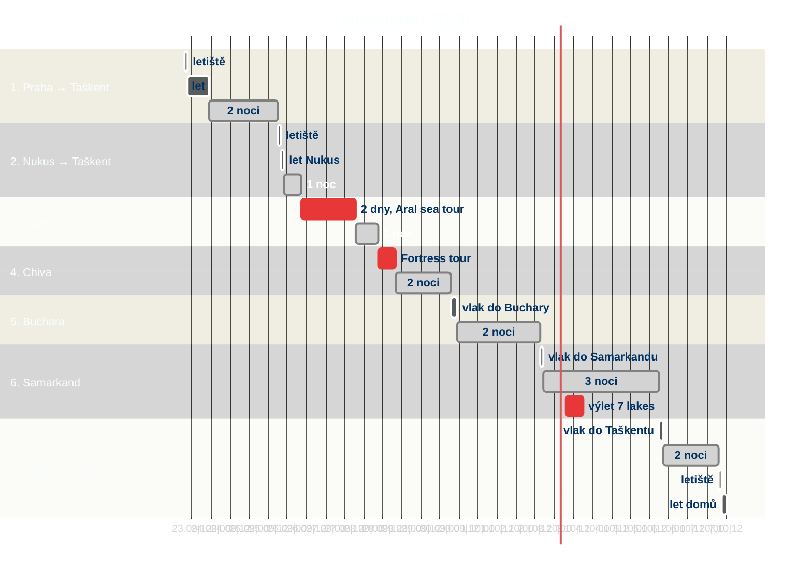
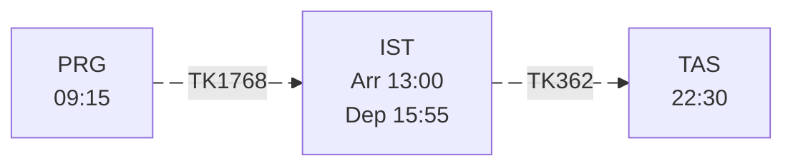
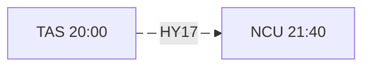
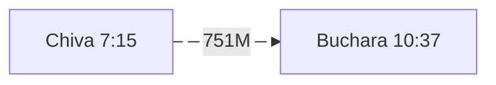
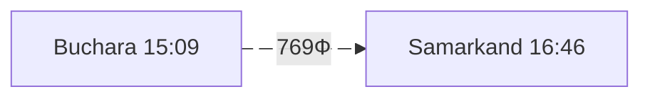
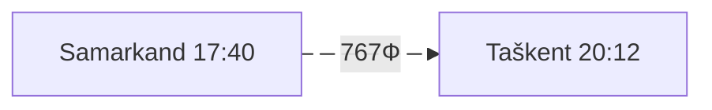
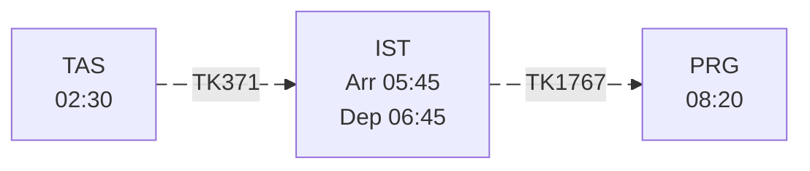

+++
title = "Uzbekistán"
date = 2026-07-31
draft = false
summary = "Planning of the trip to Uzbekistan 2026"
mermaid = true
defaultContentLanguage = "cs"

[cover]
image = "images/mtorrazzina-uzbekistan-4911018_1920.jpg"
relative = false

+++

## Itinerář
[Přehledná mapa >](https://umap.openstreetmap.fr/cs-cz/map/uzbekistan-2026_1402273#7/41.594905/62.105713)



### Diagram
*Diagram je klikací, po kliknutí přesměruje na příslušnou kapitolu itineráře*


### 23.9.2026 - Praha → Taškent
#### Let {#flight1}
Praha, Terminál 1

- 23.9.2026, Turkish Airlines

- zavazadla: 
  - 1 checkované zavazadlo: 23 kg, D+Š+V < 158 cm
  - 1 kabinové zavazadlo: 8 kg, D+Š+V < 118 cm
  - 1 personal item: 4 kg (40 x 30 x 15cm)

---
#### 23.-25.9.2026 - Ubytování {#accTAS1}
**Jahongir B&B Tashkent**
*Almasar District, Farobiy Kurgontepa 94, 100049 Taškent, Uzbekistán*, [mapa](https://maps.app.goo.gl/ALArVXtxcUFCTAte9)




### 25.9.2026 - Taškent → Nukus
#### Let {#flight2}
Taškent, Terminál 3 (*opačná strana letiště*) [mapa](https://maps.app.goo.gl/ztmrq2Sqq9W5GgNHA)
- 25.9.2026, Uzbekistan Airways

*Passengers are required to present all checked baggage and hand baggage for processing at the check-in counter.*
- zavazadla: 
  - 1 checkované zavazadlo: 23 kg, D+Š+V < 158 cm
  - 1 kabinové zavazadlo: 8 kg, D+Š+V < 115 cm, (55 x 35 x 25cm)
  - 1 personal item: 5 kg, D+Š+V < 92 cm
  
Zajištěna doprava z letiště v rámci ubytování.

---
#### 25.-26.9.2026 - Ubytování {#accNuk}
**Danexan Apa**, *Ulice Kok ozek 30/1, Nukus, Uzbekistán*, [mapa](https://maps.app.goo.gl/V6C6xD3pQvwRXW1d9)



### 26.-27.9.2026 -  Výlet Aral {#aral}
Zajištěno v rámci ubytování v Danexan Apa. Zbytné věci můžeme nechat na ubytování v Nukusu. Odjezd ráno z hotelu, příjezd druhý den večer na hotel.
- V ceně (190 USD/osoba):
	- Comfortable vehicle with air conditioning
	- Driver-guide knowledgeable about history and the area
	- Transfer and drop-off at your hotel
	- Local guide for city walking tours
	- Full board or specific meals as per program
	- All museum and park entrance fees
	- Power bank for charging mobile devices
	- Short edited travel video (vlog)
	- Overnight stay in a traditional yurt camp by the Aral Sea
	- Wet wipes and trash bags provided
	- [Beshbarmak](https://folkways.today/beshbarmak/) Experience
	- Drinking water provided
- **Itinerář**:  Nukus → Muynak → Dinner → Ustyurt Plateau → Kurgancha Kala → Aral Sea → Muynak( Ship cemetery) → Camel Farm Experience → Mizdakhan → Gaur Kala → Nukus
---
#### 27.-28.9.2026 - Ubytování {#accNuk}
**Danexan Apa**, *Ulice Kok ozek 30/1, Nukus, Uzbekistán*, [mapa](https://maps.app.goo.gl/V6C6xD3pQvwRXW1d9)



### 28.-30.9. 2026 - Chiva
#### Ancient Fortresses tour {#fortress}
- Cena 60 USD/osoba
	- Driver-guide knowledgeable about history and the area
	- Comfortable vehicle with air conditioning
	- Drinking water provided
	- Power bank for charging mobile devices
	- Short edited travel video (vlog)
	- Transfer and drop-off at your hotel
	- Full board or specific meals as per program
	- All museum and park entrance fees
- odjezd ráno z hotelu Danexan
- příjezd večer do hotelu RIZALI v Chivě
- Itinerář:  Nukus - Chilpyk – Amu Darya Fish Lunch - Kyzyl Qala – Toprak Qala – Badai Tugai Nature Reserve - Khiva
---
#### 28.-30.9.2026 - Ubytování {#accChiva}
**RIZALI Family guest house**, *Мехнат Гули 11, 220900 Chiva, Uzbekistán*, [mapa](https://maps.app.goo.gl/5XxprqrByaDixv8u9)



### 30.9-2.10.2026 - Buchara {#train1}
- přesun vlakem [Jaloliddin Manguberdi](https://upload.wikimedia.org/wikipedia/commons/thumb/9/9f/20220911_Cheongnyangni_Station_KTX-Eum_504.jpg/1920px-20220911_Cheongnyangni_Station_KTX-Eum_504.jpg?utm_source=en.wikipedia.org&utm_campaign=imageinfo&utm_content=thumbnail)

---
#### 30.9-2.10.2026 - Ubytování {#accBuch}
cca 12 km od nádraží, přesun taxíkem

**Ikat Terrace**, *Mekhtar Anbar Street 71, 200101 Buchara, Uzbekistán*, [mapa](https://maps.app.goo.gl/fu1GVwV2KfASZbPX6)



### 2.-5.10.2026 - Samarkand {#train2}
- přesun vlakem [Afrosiyob](https://upload.wikimedia.org/wikipedia/commons/8/8b/Talgo_250_Afrosiyob_05-06%2C_Bukhara_station.jpg?utm_source=en.wikipedia.org&utm_campaign=imageinfo&utm_content=thumbnail_unscaled), jízdenky zajištěny  

---
#### 3.10.2026 - Výlet na 7 jezer {#lakes}
- odjezd/příjezd k hotelu
- cena 60 USD/osoba
- zajištěno přes https://www.centraliatours.com/en
- itinerář:
	- odjezd cca 7:00 minivanem Hyundai Grand Starex
	- přechod hranice s Tádžikistánem
	- oběd okolo poledne u 3. jezera
	- procházka 30-40 min k 7. jezeru
	- návrat večer

---
#### 2.-5.10.2026 - Ubytování {#accSam}
**SAMARKAND AMIRA**, *Ali qushchi Street 43, 140101 Samarkand, Uzbekistán*, [mapa](https://maps.app.goo.gl/3BhPnrwpWXWYdJuL6)



### 5.-7.10.2026 - Taškent {#train3}
- přesun vlakem [Afrosiyob](https://upload.wikimedia.org/wikipedia/commons/8/8b/Talgo_250_Afrosiyob_05-06%2C_Bukhara_station.jpg?utm_source=en.wikipedia.org&utm_campaign=imageinfo&utm_content=thumbnail_unscaled)
- jízdenky po velkém boji zajištěny

---
#### 5.-7.10.2026 - Ubytování {#accTAS2}
**Art inn hotel**, *13 Zarbog' ko'chasi, 100031 Taškent, Uzbekistán*, [mapa](https://maps.app.goo.gl/Q6pWa61Agsrfh6EN7)



### 7.10.2026 - Taškent → Praha {#flight3}
Taškent, Terminál 2

- 7.10.2026, Turkish Airlines

- máme hodinu na přestup, což je hraniční, přesun bude svižný



### Poznámky
- výběr z bankomatů vždy zpoplatněn alespoň 1,5 %
- na taxíky použijeme aplikaci Yandex Go
- eSIM na letišti, operátor Ucell, [mapa pokrytí](https://ucell.uz/en/coverage_map), [měření](https://www.nperf.com/en/map/UZ/-/208152.Ucell-Mobile/signal?ll=39.402244340292775&lg=66.25343860869943&zoom=7)
- vlaky https://eticket.railway.uz/
- doporučené telegramové kanály: 
    - https://t.me/uzrailpassuz
    - https://t.me/railwayexpress_uz
    - https://t.me/uzrailways_uz
    - https://t.me/uzbektourismofficial




### Náklady na osobu
- letenka *PRG-IST-TAS* a zpět: 13 381 Kč :white_check_mark:
  - doplatek 469 Kč
- letenka *TAS-NCU*: 1454 Kč :white_check_mark:
- vlak *Buchara 1 → Samarkand*: 395 Kč :white_check_mark:
- vlak *Samarkand → Taškent*: 634 Kč :white_check_mark:


