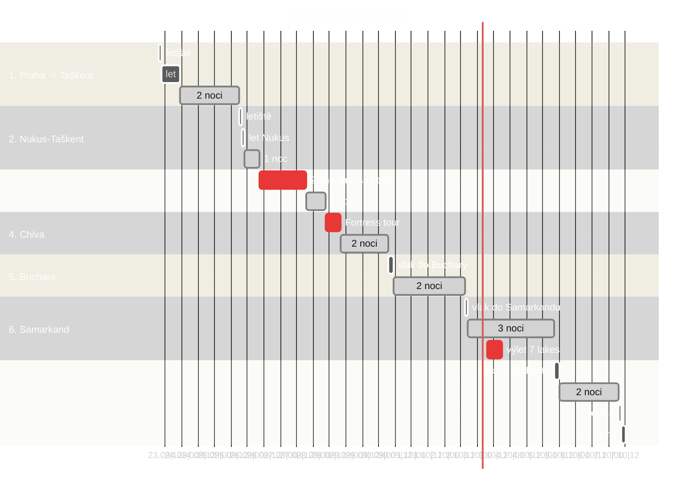

+++
title = "Uzbekistan"
date = 2026-07-31
draft = false
summary = "Planning of the trip to Uzbekistan 2026"
mermaid = true
+++

## Itinerary

### Diagram

```mermaid
%%{init: {
  'theme': 'dark',
  'themeVariables': {
    'taskTextDarkColor': '#111111',
    'taskTextLightColor': '#ffffff',
    'taskTextOutsideColor': '#ffffff'
  },
  'gantt': {
    'leftPadding': 180,
    'topAxis': false,
    'barHeight': 20,
    'barGap': 4
  }
}}%%
gantt
    title Uzbekistán 2026
    dateFormat YYYY-MM-DD HH:mm
    axisFormat %e.%m|%H
    tickInterval 12hour

    section 1. Praha -> Taškent
        letiště :a1, 2026-09-23 07:15, 2h
        let :2026-09-23 09:15, 2026-09-23 22:30
        2 noci :done,2026-09-23 22:30, 2026-09-25 18:00
        
    section 2. Nukus-Taškent
        letiště :a3, 2026-09-25 18:00, 2h
        let Nukus :2026-09-25 20:00, 2026-09-25 21:40
        1 noc :done, aa1, 2026-09-25 21:40, 2026-09-26 09:00

    section 3. Výlet Aral
        2 dny, Aral sea tour :crit, a4, 2026-09-26 09:00, 2026-09-27 19:00
        1 noc :done, aa2, 2026-09-27 19:00, 2026-09-28 09:00

    section 4. Chiva
        Fortress tour :crit, a5, 2026-09-28 09:00, 2026-09-28 20:00
        2 noci :done, a6, 2026-09-28 20:00, 2026-09-30 07:15

    section 5. Buchara
        vlak do Buchary :a7, 2026-09-30 07:15, 2026-09-30 10:37
        2 noci :done, a8, 2026-09-30 10:37, 2026-10-02 15:09

    section 6. Samarkand
        vlak do Samarkandu :a9, 2026-10-02 15:09, 2026-10-02 16:46
        3 noci :done, a10, 2026-10-02 16:46, 2026-10-05 08:10
        výlet 7 lakes :crit, aa10, 2026-10-03 07:00, 2026-10-03 18:00

    section 7. Taškent & Odlet
        vlak do Taškentu :a11, 2026-10-05 08:10, 2026-10-05 12:19
        2 noci :done, a12, 2026-10-05 12:19, 2026-10-07 07:20
        letiště :z0, 2026-10-07 07:20, 2026-10-07 09:20
        let domů :z1, 2026-10-07 09:20, 2026-10-07 12:30
```
